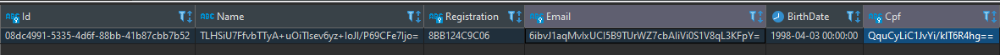

# fiap-postech-hackathon-manager

## OWASP

Verificação: <a href="./assets/owasp/documento.html">Documento</a>

## Examplos de request

### POST: /employee

```json
{
  "Name": "Guilherme Nascimento",
  "Email": "guilherme.nascimento@email.com",
  "BirthDate": "1998-04-03",
  "Cpf": "80435732048",
  "Password": "P@$$w0rd"
}
```

## Segurança

Todos os dados dos funcionários são salvos de forma criptografada no banco de dados para proteger suas informações.

Exemplo:

